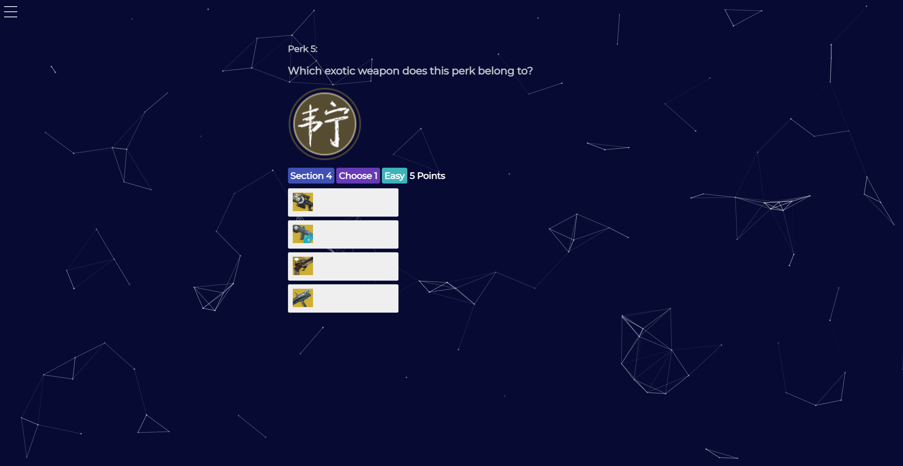
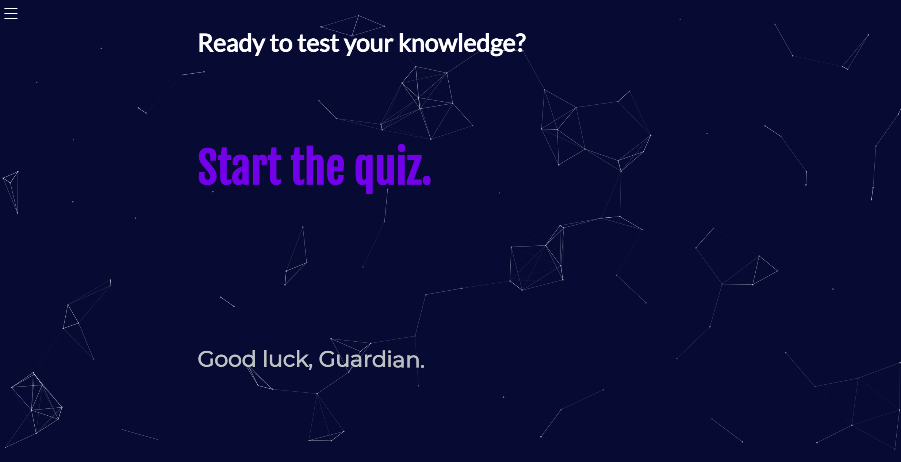
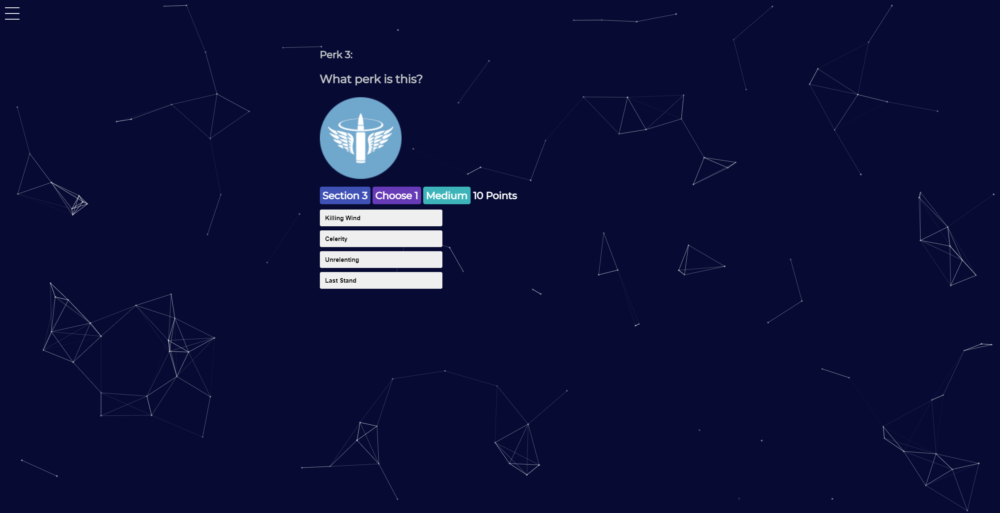

# [Destiny 2 Perk Trivia](https://master.d23nkvxb90w66x.amplifyapp.com/) 

### First Release

This is the first version of my Destiny 2 Knowledge Quiz - a small personal side-project that I've been working on lately. It is built on React.js, and uses a react-quiz-component framework.

### Future Development

For now, there is just one static quiz - that's it. In the future, I would like to add randomization to the questions, as well as create new quizzes to sort - for example: armor, mods, lore, etc. For now, these are just ideas.  

##Screenshots

## Known Issues

- Does not work on mobile! At least, "small mobile". Please view on a tablet or computer for best results!
- "Next Question" button may appear off-screen on low resolutions for certain questions.
    - If this is the case, please zoom out to click the button. (You can zoom back in afterwards)
    
## Versions

####0.1: Test Release: Proof of Concept. 3 Questions, no scoring, no feedback.
####0.2: Test Release: Home Screen & Question Expansion - added questions for columns 1 & 2.
####0.3: Added feedback after answering questions. Improved home screen. Added more questions for part 1. 
####0.4: Added 5 questions - 'obscure' perks (pinnacles) and frames.
####0.5: Testing: Photo Response. Added 5 questions (exotic perks) with image answers.
####0.6: Added 10 more exotics to the last section.
####0.7: Fixed tags and adjusted image sizes.
####0.8: Implemented scoring, adjusted descriptions, and refined image sizing for most resolutions.
####0.9 (in progress): Question randomization from a larger bank.
####1.0 (planned): Mobile support.

[CHANGELOG]: ./CHANGELOG.md
[LICENSE]: ./LICENSE.md

## Social Media
I'm not great with social media, but I try my best.
#####[My Website](https://jtrpan.azurewebsites.net)
#####[Facebook](https://www.facebook.com/james.trissin/)
#####[Twitter](https://twitter.com/jtrpan)
#####[Linkedin](https://www.linkedin.com/in/jtrpan/)